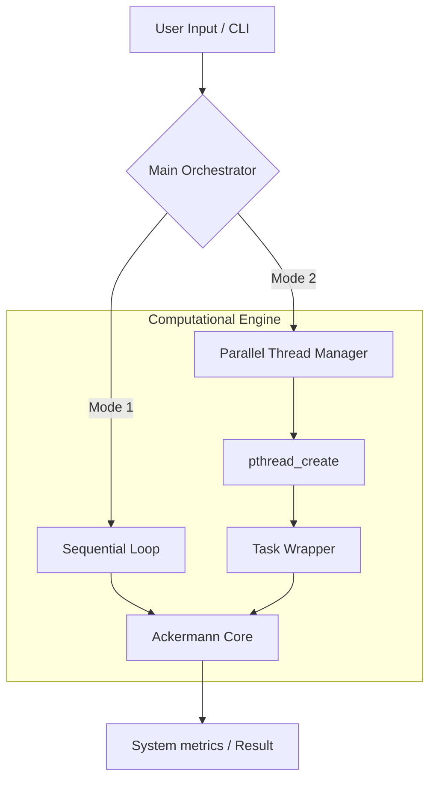
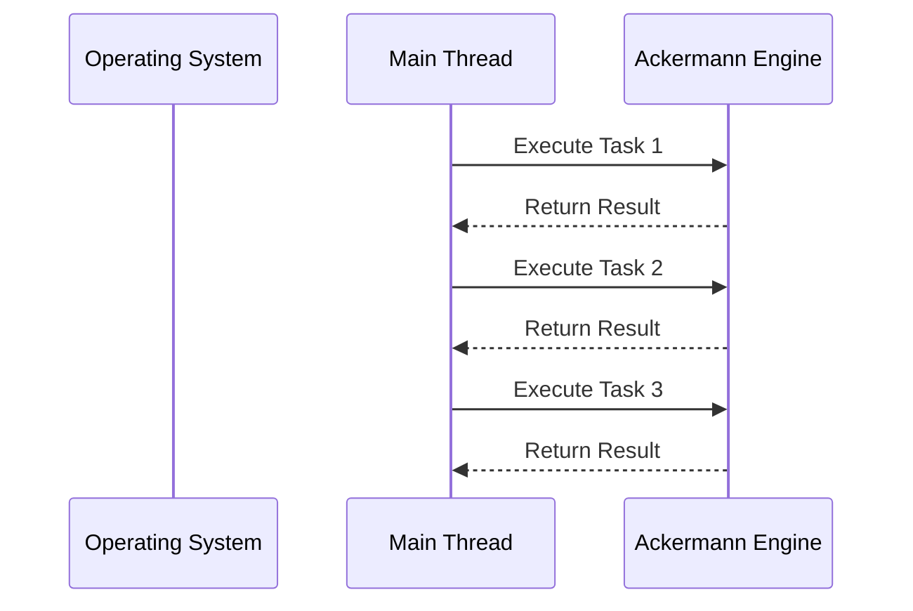
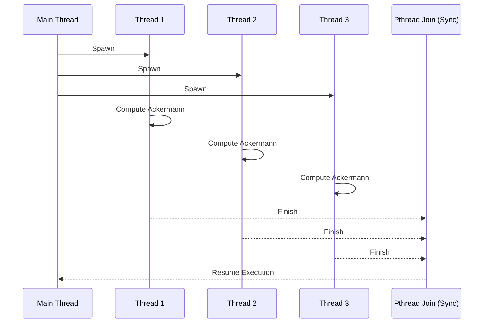

<div align="center">

# ⚡ Typical vs Threaded Program Time Tester

[](https://opensource.org/licenses/MIT)
[]()
[]()
[]()

**A high-fidelity C++ benchmarking utility designed to analyze and visualize the empirical performance gap between synchronous and concurrent execution models.**

[Overview](#-overview) • [Architecture](#-architecture) • [Features](#-key-capabilities) • [Installation](#-installation) • [Benchmarks](#-running-the-benchmarks) • [Contributing](#-contributing)

</div>

---

## 🚀 Overview

This project provides a robust, engineered environment to demonstrate the tangible benefits of multi-threading. By leveraging the **Ackermann function**—a deep, non-primitive recursive algorithm—it generates a measurable computational load that stresses the CPU, providing a clear baseline for performance optimization research.

---

## 🏗 Architecture & System Flow

The system is designed with a clear separation between the **Orchestration Layer** and the **Computational Engine**.

### High-Level System Architecture



### Execution Lifecycle

<details>
<summary><b>View Execution Flow Comparison</b></summary>

#### Mode 1: Sequential Execution
The CPU processes tasks in a linear queue, bounded by the clock speed of a single core.


#### Mode 2: Threaded Execution
The system spawns concurrent execution units, leveraging multiple hardware threads and the system's task scheduler.

</details>

---

## ✨ Key Capabilities

| Feature | Description |
| :--- | :--- |
| **High-Intensity Load** | Uses recursive depth to simulate real-world CPU stress. |
| **Deterministic Benchmarking** | Precise control over iterations and algorithmic complexity. |
| **Concurrency Analysis** | Direct comparison of `pthread` overhead vs. parallel gains. |
| **Automated Build** | Native `Makefile` integration for production-grade compilation. |
| **CI/CD Integration** | Automated build and test pipelines via GitHub Actions. |

---

## 📂 Repository Structure

```text
.
├── .github/                # CI/CD Workflows & Templates
├── assets/                 # Performance Visualizations & Screenshots
├── docs/                   # Technical Documentation & Architecture
│   ├── architecture.md     # Internal Logic Details
│   └── linux-guide.txt     # Environment Setup Guide
├── src/                    # Source Code
│   └── main.cpp            # Core Benchmarking Logic
├── Makefile                # Build System
├── LICENSE                 # MIT License
└── README.md               # Main Documentation
```

---

## 🛠 Tech Stack & Environment

- **Core Engine**: C++11 (ISO standard for reliability and performance)
- **Concurrency**: POSIX Threads (`pthread`) for low-level system interaction
- **Optimization**: GCC `-O2` flags for production-equivalent benchmarking
- **Environment**: Native Linux or Windows Subsystem for Linux (WSL2)

---

## 📦 Getting Started

### ⚙️ Installation & Build

```bash
# 1. Clone the repository
git clone https://github.com/AhmadHassan-BTed/Typical-Vs-Threaded-Program-time-tester.git

# 2. Enter the directory
cd Typical-Vs-Threaded-Program-time-tester

# 3. Compile the binary
make
```

### 🚀 Running the Benchmarks

| Command | Mode | Description |
| :--- | :--- | :--- |
| `time ./time_tester 1` | **Typical** | Runs tasks sequentially on a single thread. |
| `time ./time_tester 2` | **Threaded** | Runs tasks in parallel using `pthread`. |

---

## 📊 Performance Visualization

### Sequential Profile
*Linear progression on a single CPU core.*


### Threaded Profile
*Concurrent task execution across multiple hardware threads.*


---

## 🛠 Development Workflow

1.  **Build**: Use `make` to compile the optimized binary.
2.  **Test**: Use `make test` to run a standardized benchmark suite.
3.  **Clean**: Use `make clean` to remove build artifacts.

---

## 🤝 Contributing

We welcome contributions that improve the accuracy of our benchmarking or add support for additional threading models (e.g., OpenMP, C++11 Threads). Please refer to [CONTRIBUTING.md](CONTRIBUTING.md).

## 📄 License

Distributed under the **MIT License**. See `LICENSE` for more information.

---

<div align="center">
    <b>Crafted with dedication by <a href="https://github.com/AhmadHassan-BTed">Ahmad Hassan</a></b><br>
    <i>Engineering transparency through performance analysis.</i>
</div>
