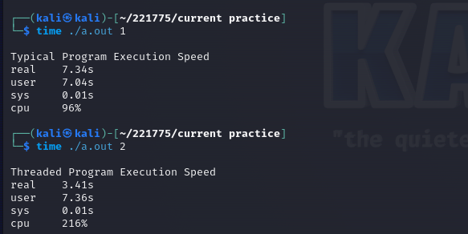
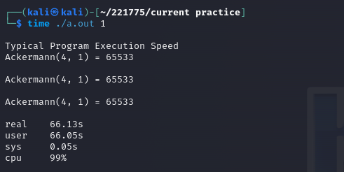
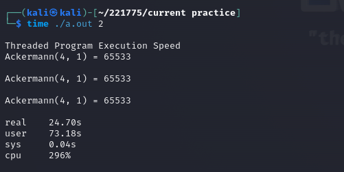
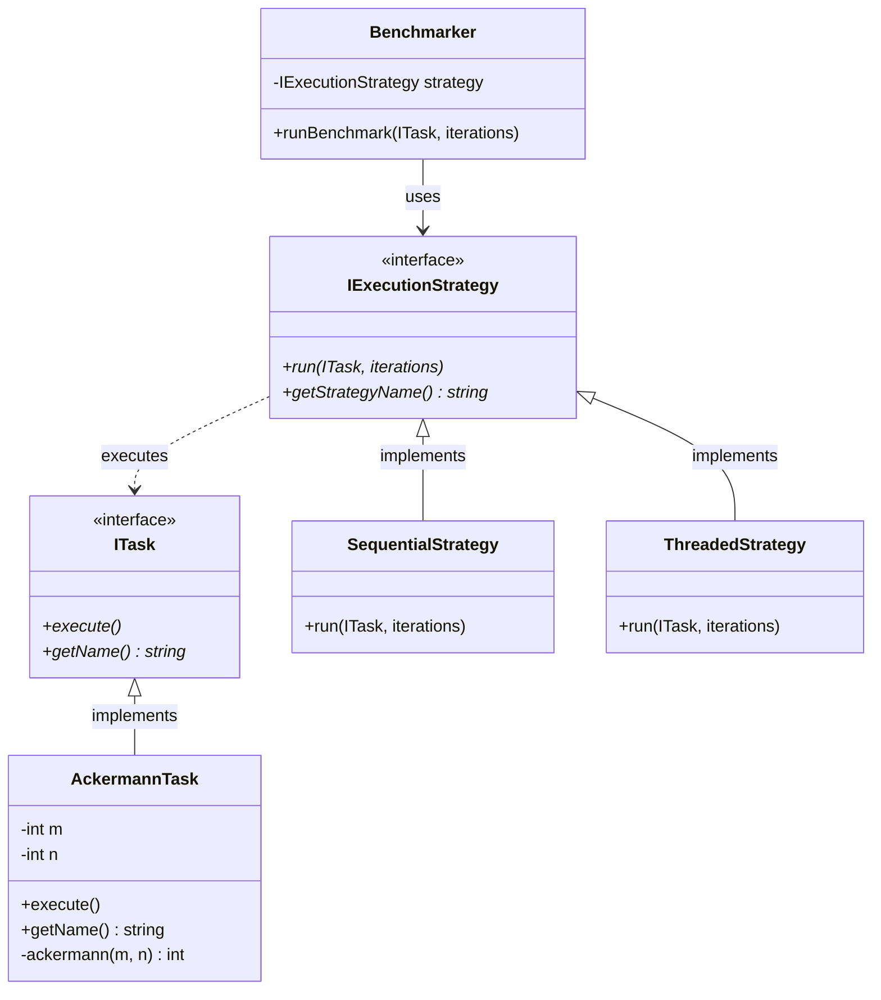
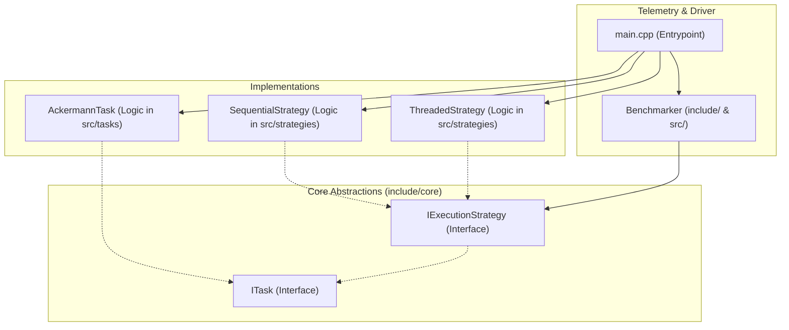
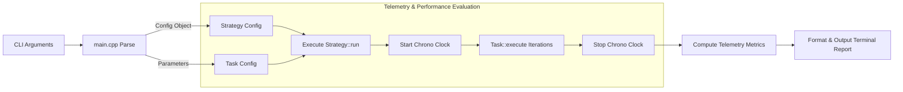
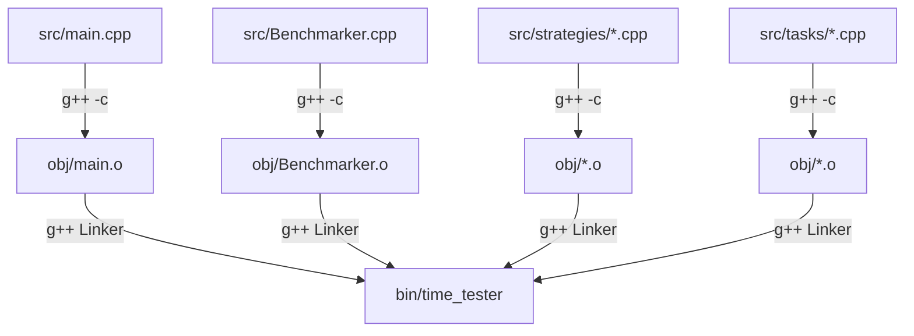

<div align="center">

# ThreadRace ⏱️

### _A C++ Concurrency Telemetry Framework & Execution Speed Tester_

[](https://opensource.org/licenses/MIT)
[]()
[]()

**Time is a non-renewable, precious human resource. ThreadRace is designed to measure, analyze, and visualize the performance differential between sequential and parallel execution paradigms.**

[Philosophy](#-philosophy) • [Demonstration](#-demonstration) • [Architecture](#-architecture-overview) • [Workflow](#-system-workflow) • [Repository Structure](#-repository-structure) • [Build & Run](#-build--execution-pipeline) • [Contributing](#-development-workflow)

---

</div>

## 🕯️ Philosophy

In daily human life, tasks are split and executed simultaneously to conserve time-cooking while listening to audio, or thinking about future plans while walking. **ThreadRace** is an engineering reflection of this fundamental human urge: **the quest for concurrency**.

By comparing **Typical (Sequential)** execution with **Threaded (Parallel)** execution, ThreadRace measures the efficiency of digital cooperation. The **Ackermann Function**-a deeply recursive mathematical operation-is utilized as a benchmark task to represent high-complexity, processor-intensive operations that demand efficient thread synchronization and compute optimization.

---

## 📊 Demonstration

ThreadRace runs computations in two modes to highlight the divergence between sequential effort and concurrent execution.

<p align="center">
  <b>Regular Execution Benchmark</b><br>
  
</p>

<p align="center">
  <b>Ackermann Function Benchmark (m=4, n=1)</b><br>
  
  
</p>

---

## 🏗️ Architecture Overview

The codebase is built on the **Strategy Design Pattern** to guarantee strict decoupling between benchmarking logic, task definitions, and concrete execution models.

### Static Structure (Class Relationships)

The class relationship structure isolates execution models from task logic, allowing strategies to handle runtime iteration scheduling independently.



### Internal Module Structure

The directory separation strictly splits interfaces from implementation classes and compiled targets.



---

## 🔄 System Workflow & Request Lifecycle

When a run is initiated via the command line, the execution flows through parsing, strategy instantiation, timed processing, and telemetry reporting.

```mermaid
sequenceDiagram
    participant User as Terminal CLI
    participant Main as main.cpp
    participant Bench as Benchmarker
    participant Strategy as IExecutionStrategy
    participant Task as ITask

    User->>Main: Execute program with mode & iterations
    Main->>Strategy: Instantiate (Sequential or Threaded)
    Main->>Task: Instantiate AckermannTask(4, 1)
    Main->>Bench: Instantiate with selected Strategy
    Main->>Bench: runBenchmark(Task, iterations)

    rect rgb(28, 30, 36)
        Note over Bench, Task: Telemetry Capture Span
        Bench->>Bench: Start high_resolution_clock timer
        Bench->>Strategy: run(Task, iterations)

        loop For each Iteration
            Strategy->>Task: execute()
            Task->>Task: Compute Ackermann value
            Task-->>Strategy: Return Result (65533)
        end

        Strategy-->>Bench: Return Control
        Bench->>Bench: Stop high_resolution_clock timer
    end

    Bench-->>User: Output timings (Real, User, System, CPU%)
```



### Concurrency and Telemetry Specifications

- **Parallelism Engine:** Standard C++11 Threads (`std::thread`) are used to coordinate concurrent thread launches.
- **Telemetry precision:** High-resolution timing is driven by `std::chrono::high_resolution_clock` with nanosecond precision capability.
- **Memory Management:** Automatic resource cleanup is enforced via modern C++ smart pointers (`std::shared_ptr`).

---

## 💾 Data & Request Lifecycle Flow

The parameters and runtime performance data flow through the framework as detailed below:



---

## 📂 Repository Structure

The physical layout of the codebase isolates header declarations from implementation details:

```
ThreadRace/
├── .editorconfig
├── .gitignore
├── CODE_OF_CONDUCT.md
├── CONTRIBUTING.md
├── LICENSE
├── Makefile
├── README.md
├── SECURITY.md
├── assets/
│   ├── ack-1.png
│   ├── ack-2.png
│   └── reg.png
├── docs/
│   ├── architecture.md
│   └── development.md
├── include/
│   ├── Benchmarker.hpp
│   ├── core/
│   │   ├── IExecutionStrategy.hpp
│   │   └── ITask.hpp
│   ├── strategies/
│   │   ├── SequentialStrategy.hpp
│   │   └── ThreadedStrategy.hpp
│   └── tasks/
│       └── AckermannTask.hpp
└── src/
    ├── Benchmarker.cpp
    ├── main.cpp
    ├── strategies/
    │   ├── SequentialStrategy.cpp
    │   └── ThreadedStrategy.cpp
    └── tasks/
        └── AckermannTask.cpp
```

---

## 🛠️ Build & Execution Pipeline

The compilation process is managed by a POSIX-compliant Makefile, compiling C++ files with production optimizations (`-O2`).



### 📦 Compilation

Compile the source code using the provided `Makefile`:

```bash
make
```

### ⚡ Running Benchmarks

Run the binary with execution strategy modes and iteration count:

| Command               | Execution Model          | Description                                          |
| :-------------------- | :----------------------- | :--------------------------------------------------- |
| `./bin/time_tester 1` | **Sequential (Typical)** | Tasks run sequentially in a single execution thread. |
| `./bin/time_tester 2` | **Parallel (Threaded)**  | Tasks run concurrently across multiple threads.      |

Custom iterations can be appended as a trailing argument (defaults to `3`):

```bash
# Execute threaded strategy with 5 iterations
./bin/time_tester 2 5
```

---

## 🚀 Development Workflow

Contributors are welcome to submit improvements or add new performance benchmarks. The following pipeline ensures stability:

<details>
<summary><b>1. Functional Verification</b></summary>

Ensure the core Ackermann output calculation remains functional and math-accurate:

- `Ackermann(4, 1)` must return `65533`.
    </details>

<details>
<summary><b>2. Concurrency Stress Testing</b></summary>

Verify stability under threaded loads:

- Execute mode 2 with a high number of iterations to test against thread leaks or runtime race conditions.
    </details>

<details>
<summary><b>3. CI/CD Integration</b></summary>

On every push or pull request to the `main` branch, a GitHub Action is triggered to:

- Configure a clean Ubuntu runner.
- Validate system compilation with `make`.
- Execute regression benchmarks with `make test`.
    </details>

---

## 🌌 Credits & Dedication

**ThreadRace** was created and engineered by **[Ahmad Hassan (B-Ted)](https://github.com/AhmadHassan-BTed)**.  
_Dedicated to the beauty and clarity of highly efficient, low-overhead systems._
