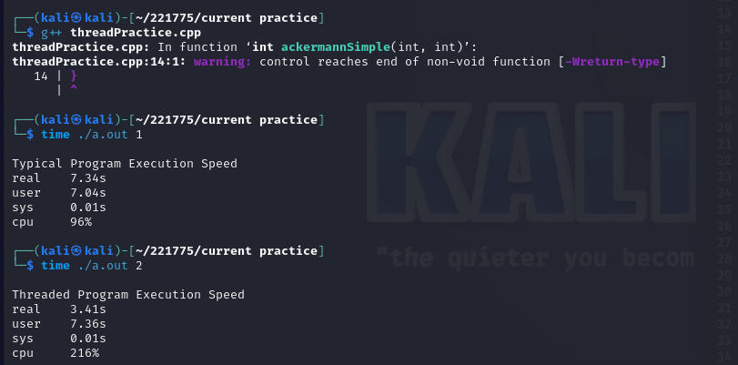
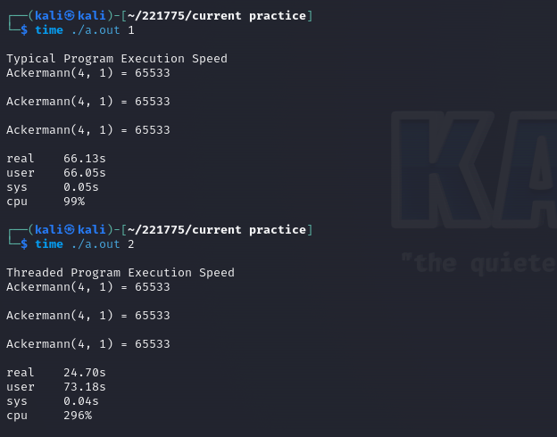
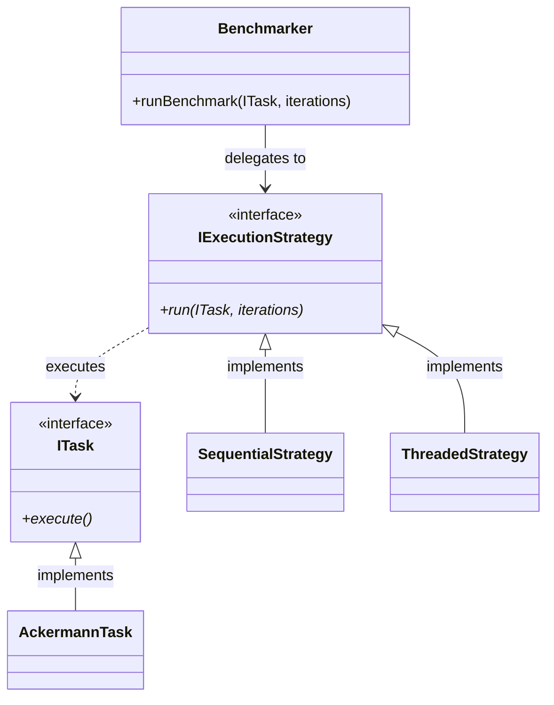
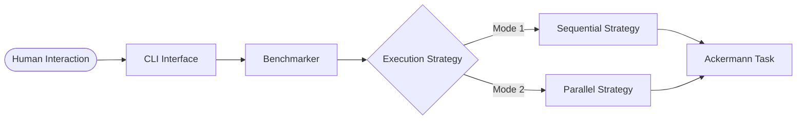

<div align="center">

# 🕰️ The Pulse of Parallelism

### _Measuring the Human Effort of Time_

[](https://opensource.org/licenses/MIT)
[]()
[]()

**Time is our most precious resource. In the digital realm, we strive to bend it, split it, and harmonize it.**


<p align="center">
  
  
</p>


[Overview](#-overview) • [Architecture](docs/architecture.md) • [Contributing](CONTRIBUTING.md) • [Security](SECURITY.md) • [Code of Conduct](CODE_OF_CONDUCT.md)

</div>

---

## 🕯️ The Human Connection

In our daily lives, we multitask to save time—listening to a podcast while cooking, or thinking about tomorrow while walking today. This project is a reflection of that human desire: **the quest for concurrency**.

By comparing **Typical (Sequential)** execution with **Threaded (Parallel)** execution, we don't just measure CPU cycles; we measure the efficiency of digital cooperation. We use the **Ackermann Function**—a mathematical beast of recursive depth—to represent the complex, deep-seated tasks that define our modern experience.

---

### 🏗️ System Design & Patterns

This project implements the **Strategy Pattern** to achieve absolute decoupling. The orchestrator doesn't care _how_ a task is run, and the task doesn't care _who_ is running it.



### 🧩 Modular Blueprint

- **Core Interfaces**: `ITask` and `IExecutionStrategy` define the contract of performance.
- **Task Engine**: The `AckermannTask` encapsulates the computational weight.
- **Execution Strategies**: Switch seamlessly between `SequentialStrategy` (the lone worker) and `ThreadedStrategy` (the synchronized team).
- **Orchestrator**: The `Benchmarker` acts as the master of ceremonies, capturing the essence of elapsed time.



---

## 🚀 Awakening the Engine

### 📦 Installation

Bring the project to life with a single command:

```bash
make
```

### ⚡ Running the Benchmark

Witness the difference between linear effort and collective power.

| Command               | Soul                | Description                                                       |
| :-------------------- | :------------------ | :---------------------------------------------------------------- |
| `./bin/time_tester 1` | **The Lone Worker** | Tasks are executed one by one, with focused, singular effort.     |
| `./bin/time_tester 2` | **The Chorus**      | Tasks are executed in parallel, a symphony of concurrent threads. |

_You can also specify the number of iterations (default is 3):_

```bash
./bin/time_tester 2 5
```

---

## 📊 The Weight of Time

When you run these tests, you are observing the **overhead of creation** versus the **reward of cooperation**.

- **Sequential** is reliable, simple, but bound by the limits of a single core.
- **Threaded** is fast, expansive, but requires the energy of synchronization.

---

<div align="center">

### 🌌 Let's build a faster tomorrow, together.

**Crafted with 🖤 by [Ahmad Hassan](https://github.com/AhmadHassan-BTed)**  
_Dedicated to the beauty of efficient systems._

</div>
