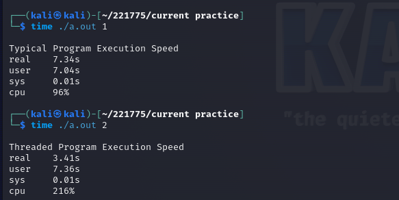
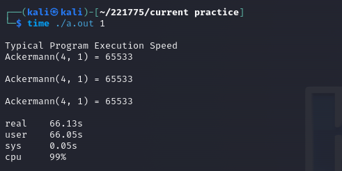
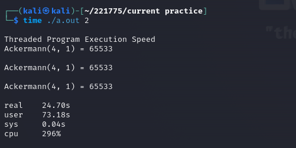
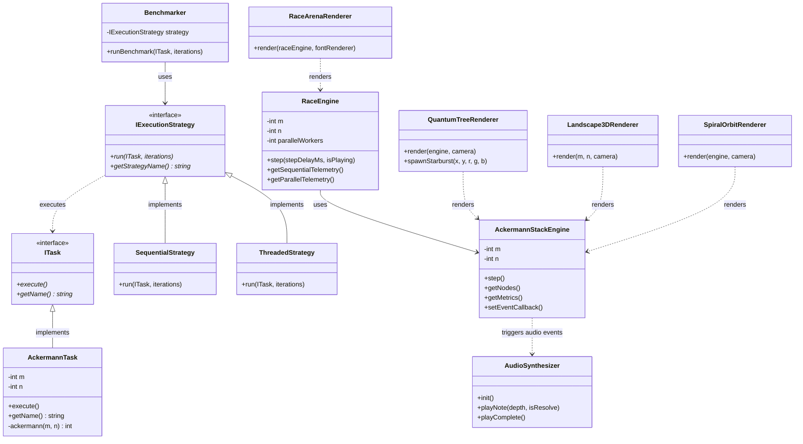
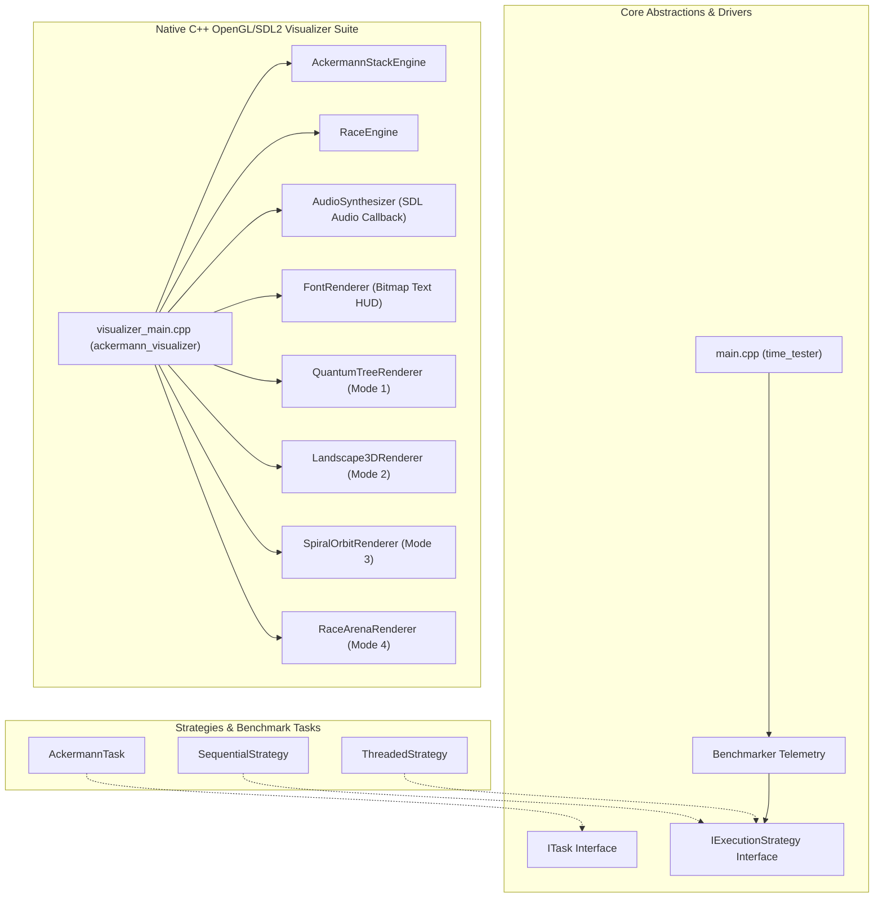
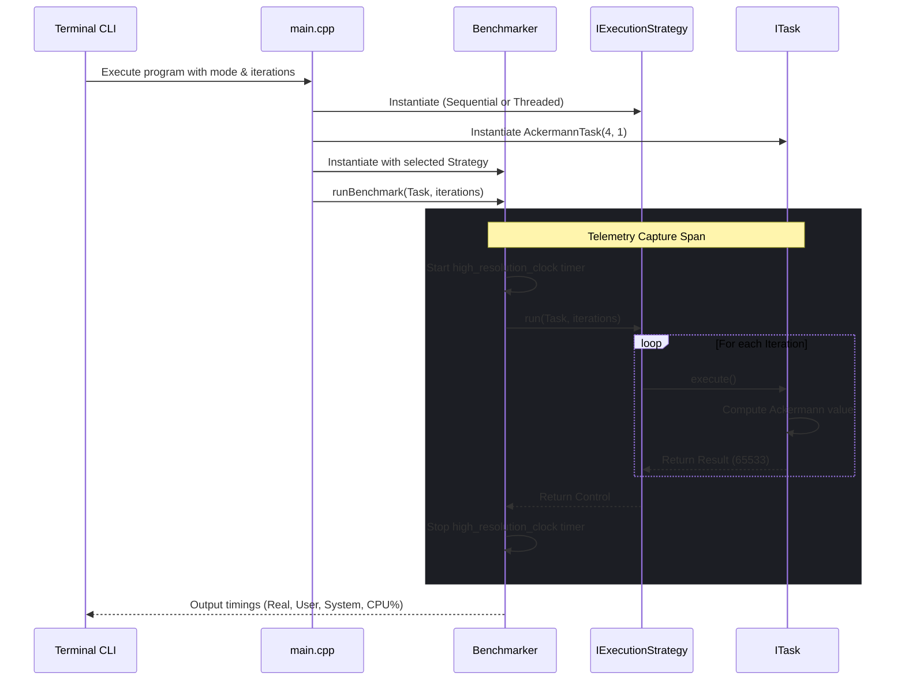
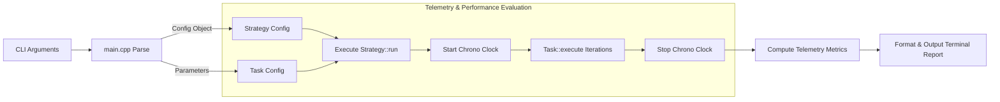
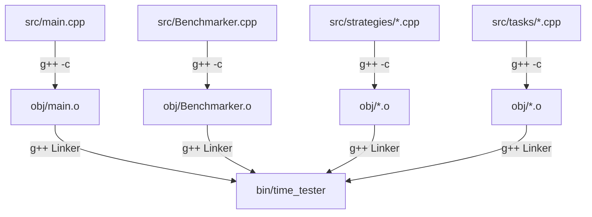

<div align="center">

# ThreadRace

### _A C++ Concurrency Telemetry Framework & Execution Speed Tester_

[](https://opensource.org/licenses/MIT)
[]()
[]()

**Time is a non-renewable, precious human resource. ThreadRace is designed to measure, analyze, and visualize the performance differential between sequential and parallel execution paradigms.**

[Philosophy](#philosophy) • [Demonstration](#visual-showcase--demonstration) • [Architecture](#architecture-overview) • [Workflow](#system-workflow--request-lifecycle) • [Repository Structure](#repository-structure) • [Build & Run](#build--execution-pipeline) • [Contributing](#development-workflow)

---

</div>

## Philosophy

In daily human life, tasks are split and executed simultaneously to conserve time-cooking while listening to audio, or thinking about future plans while walking. **ThreadRace** is an engineering reflection of this fundamental human urge: **the quest for concurrency**.

By comparing **Typical (Sequential)** execution with **Threaded (Parallel)** execution, ThreadRace measures the efficiency of digital cooperation. The **Ackermann Function**-a deeply recursive mathematical operation-is utilized as a benchmark task to represent high-complexity, processor-intensive operations that demand efficient thread synchronization and compute optimization.

---

## Visual Showcase & Demonstration

ThreadRace provides high-precision CLI timing telemetry alongside a **60 FPS Native C++ SDL2 + OpenGL Hardware-Accelerated Visualizer Suite** (`bin/ackermann_visualizer`).

### Visualizer Suite Modes

<p align="center">
  <b>Mode 1: Quantum Branching Network (2D/3D Force Tree)</b><br>
  
</p>
<p align="center">
  <i>Displays the dynamic recursive execution tree with glowing OpenGL nodes, Bezier branch curves, starburst particles on base-case evaluations, and real-time camera tracking.</i>
</p>

<br>

<p align="center">
  <b>Mode 2: Hyper-Logarithmic 3D Landscape (OpenGL Terrain Height Map)</b><br>
  
</p>
<p align="center">
  <i>Visualizes Ackermann growth $A(m, n)$ on a 3D height field terrain log-compressed using $Z(m, n) = \ln(1 + \ln(1 + A(m, n)))$.</i>
</p>

<br>

<p align="center">
  <b>Mode 3: Golden Spiral Phase Orbit</b><br>
  
</p>
<p align="center">
  <i>Maps call stack depth and frame steps onto a logarithmic golden ratio $\phi$ particle galaxy with glowing orbit trails and depth rings.</i>
</p>

<br>

<p align="center">
  <b>Mode 4: Head-to-Head Thread Race Arena</b><br>
  
</p>
<p align="center">
  <i>Direct side-by-side competition comparing Sequential (1 Thread) vs. Parallel Execution, showing active threads, memory footprint, speedup telemetry, step progress bars, and finish line detection.</i>
</p>

<br>

### Execution Benchmark CLI Outputs

<p align="center">
  <b>Regular Execution Benchmark Output</b><br>
  
</p>

<p align="center">
  <b>Ackermann Function Benchmark Telemetry (m=4, n=1)</b><br>
  
  
</p>

---

## Native C++ Ackermann Visualizer Suite

The native visualizer suite (`bin/ackermann_visualizer`) bridges pure math, real-time audio synthesis, OpenGL graphic rendering, and threading telemetry into an immersive interactive application.

### Key Features:
- **Mode 1 — Quantum Branching Network (2D/3D Force Tree):** Interactive visual trace of recursive call stacks with animated pulse propagation, base-case starbursts, organic Bezier connectors, and target camera focus.
- **Mode 2 — Hyper-Logarithmic 3D Landscape:** Renders exponential mathematical functions on a dynamic 3D surface grid compressed via hyper-logarithmic functions.
- **Mode 3 — Golden Spiral Phase Orbit:** Orbital phase-space visualization based on the golden ratio ($\phi$) mapping stack depth to radial velocity and particle emissions.
- **Mode 4 — Head-to-Head Thread Race Arena:** Side-by-side execution race between single-threaded and multi-threaded worker pools with live progress bars, memory meters, and speedup ratios.
- **Polyphonic Audio Sonification:** Real-time SDL2 audio callback synthesizing C-major pentatonic harmonic notes as recursive stacks push and resolve.
- **Demystifier HUD Overlay & Trajectory Tracking:** Live parameter feedback, active stack depth counters, call count statistics, and control key legend.

### Build & Run Native C++ Visualizer:
```bash
make all
./bin/ackermann_visualizer [m] [n]
```

### Keyboard & Mouse Controls:
- **`1` / `2` / `3` / `4`**: Switch Render Modes (1: Quantum Tree, 2: 3D Landscape, 3: Golden Spiral Orbit, 4: Thread Race Arena)
- **`SPACE` / `P`**: Play / Pause simulation evaluation
- **`S`**: Single Step forward (when paused)
- **`R`**: Reset / Restart simulation
- **`[` / `]`**: Adjust $m$ parameter value
- **`-` / `+`**: Adjust $n$ parameter value
- **`LEFT` / `RIGHT`**: Adjust step delay (ms per iteration step)
- **`I` / `O`**: Zoom In / Zoom Out camera view (0.01x - 20x)
- **`M`**: Toggle Real-time Audio Sonification ON/OFF
- **`H`**: Toggle On-Screen Demystifier HUD Overlay
- **Mouse Drag / Scroll Wheel**: Pan camera position & Smooth zoom controls
- **`ESC` / `Q`**: Quit visualizer suite

---

## Architecture Overview

The codebase uses clean object-oriented patterns isolating telemetry capture, computational task definitions, execution strategies, and visual rendering modules.

### Static Structure (Class Relationships)


```mermaid
classDiagram
    class ITask {
        <<interface>>
        +execute()*
        +getName()* string
    }

    class IExecutionStrategy {
        <<interface>>
        +run(ITask, iterations)*
        +getStrategyName()* string
    }

    class AckermannTask {
        -int m
        -int n
        +execute()
        +getName() string
        -ackermann(m, n) int
    }

    class SequentialStrategy {
        +run(ITask, iterations)
    }

    class ThreadedStrategy {
        +run(ITask, iterations)
    }

    class Benchmarker {
        -IExecutionStrategy strategy
        +runBenchmark(ITask, iterations)
    }

    class AckermannStackEngine {
        -int m
        -int n
        +step()
        +getNodes()
        +getMetrics()
        +setEventCallback()
    }

    class RaceEngine {
        -int m
        -int n
        -int parallelWorkers
        +step(stepDelayMs, isPlaying)
        +getSequentialTelemetry()
        +getParallelTelemetry()
    }

    class AudioSynthesizer {
        +init()
        +playNote(depth, isResolve)
        +playComplete()
    }

    class QuantumTreeRenderer {
        +render(engine, camera)
        +spawnStarburst(x, y, r, g, b)
    }

    class Landscape3DRenderer {
        +render(m, n, camera)
    }

    class SpiralOrbitRenderer {
        +render(engine, camera)
    }

    class RaceArenaRenderer {
        +render(raceEngine, fontRenderer)
    }

    ITask <|-- AckermannTask : implements
    IExecutionStrategy <|-- SequentialStrategy : implements
    IExecutionStrategy <|-- ThreadedStrategy : implements
    Benchmarker --> IExecutionStrategy : uses
    IExecutionStrategy ..> ITask : executes
    RaceEngine --> AckermannStackEngine : uses
    QuantumTreeRenderer ..> AckermannStackEngine : renders
    Landscape3DRenderer ..> AckermannStackEngine : renders
    SpiralOrbitRenderer ..> AckermannStackEngine : renders
    RaceArenaRenderer ..> RaceEngine : renders
    AckermannStackEngine ..> AudioSynthesizer : triggers audio events
```

### Internal Module Structure


```mermaid
%%{init: {'flowchart': {'curve': 'ortho'}}}%%
flowchart TD
    subgraph CoreAbstractions ["Core Abstractions & Drivers"]
        ITask["ITask Interface"]
        IExecutionStrategy["IExecutionStrategy Interface"]
        Benchmarker["Benchmarker Telemetry"]
        Main["main.cpp (time_tester)"]
    end

    subgraph StrategiesAndTasks ["Strategies & Benchmark Tasks"]
        AckermannTask["AckermannTask"]
        SequentialStrategy["SequentialStrategy"]
        ThreadedStrategy["ThreadedStrategy"]
    end

    subgraph VisualizerSuite ["Native C++ OpenGL/SDL2 Visualizer Suite"]
        VisMain["visualizer_main.cpp (ackermann_visualizer)"]
        StackEngine["AckermannStackEngine"]
        RaceEngine["RaceEngine"]
        AudioSynth["AudioSynthesizer (SDL Audio Callback)"]
        FontRenderer["FontRenderer (Bitmap Text HUD)"]
        
        TreeRender["QuantumTreeRenderer (Mode 1)"]
        LandRender["Landscape3DRenderer (Mode 2)"]
        OrbitRender["SpiralOrbitRenderer (Mode 3)"]
        ArenaRender["RaceArenaRenderer (Mode 4)"]
    end

    AckermannTask -.-> ITask
    SequentialStrategy -.-> IExecutionStrategy
    ThreadedStrategy -.-> IExecutionStrategy
    Benchmarker --> IExecutionStrategy
    Main --> Benchmarker

    VisMain --> StackEngine
    VisMain --> RaceEngine
    VisMain --> AudioSynth
    VisMain --> FontRenderer
    VisMain --> TreeRender
    VisMain --> LandRender
    VisMain --> OrbitRender
    VisMain --> ArenaRender
```

---

## System Workflow & Request Lifecycle

When a run is initiated via the command line, the execution flows through parsing, strategy instantiation, timed processing, and telemetry reporting.


```mermaid
sequenceDiagram
    participant User as Terminal CLI
    participant Main as main.cpp
    participant Bench as Benchmarker
    participant Strategy as IExecutionStrategy
    participant Task as ITask

    User->>Main: Execute program with mode & iterations
    Main->>Strategy: Instantiate (Sequential or Threaded)
    Main->>Task: Instantiate AckermannTask(4, 1)
    Main->>Bench: Instantiate with selected Strategy
    Main->>Bench: runBenchmark(Task, iterations)

    rect rgb(28, 30, 36)
        Note over Bench, Task: Telemetry Capture Span
        Bench->>Bench: Start high_resolution_clock timer
        Bench->>Strategy: run(Task, iterations)

        loop For each Iteration
            Strategy->>Task: execute()
            Task->>Task: Compute Ackermann value
            Task-->>Strategy: Return Result (65533)
        end

        Strategy-->>Bench: Return Control
        Bench->>Bench: Stop high_resolution_clock timer
    end

    Bench-->>User: Output timings (Real, User, System, CPU%)
```

### Concurrency and Telemetry Specifications

- **Parallelism Engine:** Standard C++11 Threads (`std::thread`) are used to coordinate concurrent thread launches.
- **Telemetry precision:** High-resolution timing is driven by `std::chrono::high_resolution_clock` with nanosecond precision capability.
- **Memory Management:** Automatic resource cleanup is enforced via modern C++ smart pointers (`std::shared_ptr`).

---

## Data & Request Lifecycle Flow

The parameters and runtime performance data flow through the framework as detailed below:


```mermaid
%%{init: {'flowchart': {'curve': 'ortho'}}}%%
flowchart LR
    Args[CLI Arguments] --> Parse[main.cpp Parse]
    Parse -->|Config Object| Strategy[Strategy Config]
    Parse -->|Parameters| Task[Task Config]

    subgraph TelemetryContext ["Telemetry & Performance Evaluation"]
        Strategy --> RunStrategy[Execute Strategy::run]
        Task --> RunStrategy

        RunStrategy --> Timer[Start Chrono Clock]
        Timer --> CoreComputation[Task::execute Iterations]
        CoreComputation --> TimerStop[Stop Chrono Clock]
    end

    TimerStop --> Metrics[Compute Telemetry Metrics]
    Metrics --> Terminal[Format & Output Terminal Report]
```

---

## Repository Structure

The physical layout isolates public include headers, logic implementations, graphics assets, and compiled targets:

```
ThreadRace/
├── .editorconfig
├── .gitignore
├── CODE_OF_CONDUCT.md
├── CONTRIBUTING.md
├── LICENSE
├── Makefile
├── README.md
├── SECURITY.md
├── assets/
│   ├── Visualization1.png    # Mode 1: Quantum Tree Screenshot
│   ├── Visualization2.png    # Mode 2: 3D Landscape Screenshot
│   ├── Visualization3.png    # Mode 3: Spiral Orbit Screenshot
│   ├── Visualization4.png    # Mode 4: Thread Race Arena Screenshot
│   ├── ack-1.png             # Sequential Ackermann CLI Output
│   ├── ack-2.png             # Threaded Ackermann CLI Output
│   └── reg.png               # Regular Benchmark CLI Output
├── docs/
│   ├── architecture.md       # High-Level Design & Visualizer System Architecture
│   └── development.md        # Build Instructions & Test Protocols
├── include/
│   ├── Benchmarker.hpp
│   ├── core/
│   │   ├── IExecutionStrategy.hpp
│   │   └── ITask.hpp
│   ├── strategies/
│   │   ├── SequentialStrategy.hpp
│   │   └── ThreadedStrategy.hpp
│   ├── tasks/
│   │   └── AckermannTask.hpp
│   └── visualizer/
│       ├── AckermannStackEngine.hpp
│       ├── AudioSynthesizer.hpp
│       ├── FontRenderer.hpp
│       ├── Landscape3DRenderer.hpp
│       ├── QuantumTreeRenderer.hpp
│       ├── RaceArenaRenderer.hpp
│       ├── RaceEngine.hpp
│       └── SpiralOrbitRenderer.hpp
├── bin/                      # Compiled Executables (time_tester, ackermann_visualizer)
├── obj/                      # Compiled Object Files
└── src/
    ├── Benchmarker.cpp
    ├── main.cpp
    ├── strategies/
    │   ├── SequentialStrategy.cpp
    │   └── ThreadedStrategy.cpp
    ├── tasks/
    │   └── AckermannTask.cpp
    └── visualizer/
        ├── AckermannStackEngine.cpp
        ├── AudioSynthesizer.cpp
        ├── FontRenderer.cpp
        ├── Landscape3DRenderer.cpp
        ├── QuantumTreeRenderer.cpp
        ├── RaceArenaRenderer.cpp
        ├── RaceEngine.cpp
        ├── SpiralOrbitRenderer.cpp
        └── visualizer_main.cpp
```

---

## Build & Execution Pipeline

The compilation process is managed by a POSIX-compliant Makefile, compiling C++ files with production optimizations (`-O2`).


```mermaid
%%{init: {'flowchart': {'curve': 'ortho'}}}%%
flowchart TD
    SrcMain["src/main.cpp"] -->|g++ -c| ObjMain["obj/main.o"]
    SrcBench["src/Benchmarker.cpp"] -->|g++ -c| ObjBench["obj/Benchmarker.o"]
    SrcStrat["src/strategies/*.cpp"] -->|g++ -c| ObjStrat["obj/*.o"]
    SrcTasks["src/tasks/*.cpp"] -->|g++ -c| ObjTasks["obj/*.o"]

    ObjMain -->|g++ Linker| Bin["bin/time_tester"]
    ObjBench -->|g++ Linker| Bin
    ObjStrat -->|g++ Linker| Bin
    ObjTasks -->|g++ Linker| Bin
```

### Compilation

Compile the source code using the provided `Makefile`:

```bash
make all
```

### Running Benchmarks

Run the binary with execution strategy modes and iteration count:

| Command | Execution Model | Description |
| :--- | :--- | :--- |
| `./bin/time_tester 1` | **Sequential (Typical)** | Tasks run sequentially in a single execution thread. |
| `./bin/time_tester 2` | **Parallel (Threaded)** | Tasks run concurrently across multiple threads. |

Custom iterations can be appended as a trailing argument (defaults to `3`):

```bash
# Execute threaded strategy with 5 iterations
./bin/time_tester 2 5
```

---

## Development Workflow

Contributors are welcome to submit improvements or add new performance benchmarks. The following pipeline ensures stability:

<details>
<summary><b>1. Functional Verification</b></summary>

Ensure the core Ackermann output calculation remains functional and math-accurate:

- `Ackermann(4, 1)` must return `65533`.
</details>

<details>
<summary><b>2. Concurrency Stress Testing</b></summary>

Verify stability under threaded loads:

- Execute mode 2 with a high number of iterations to test against thread leaks or runtime race conditions.
</details>

<details>
<summary><b>3. CI/CD Integration</b></summary>

On every push or pull request to the `main` branch, a GitHub Action is triggered to:

- Configure a clean Ubuntu runner.
- Validate system compilation with `make`.
- Execute regression benchmarks with `make test`.
</details>

---

## Credits & Dedication

**ThreadRace** was created and engineered by **[Ahmad Hassan (B-Ted)](https://github.com/AhmadHassan-BTed)**.  
_Dedicated to the beauty and clarity of highly efficient, low-overhead systems._
