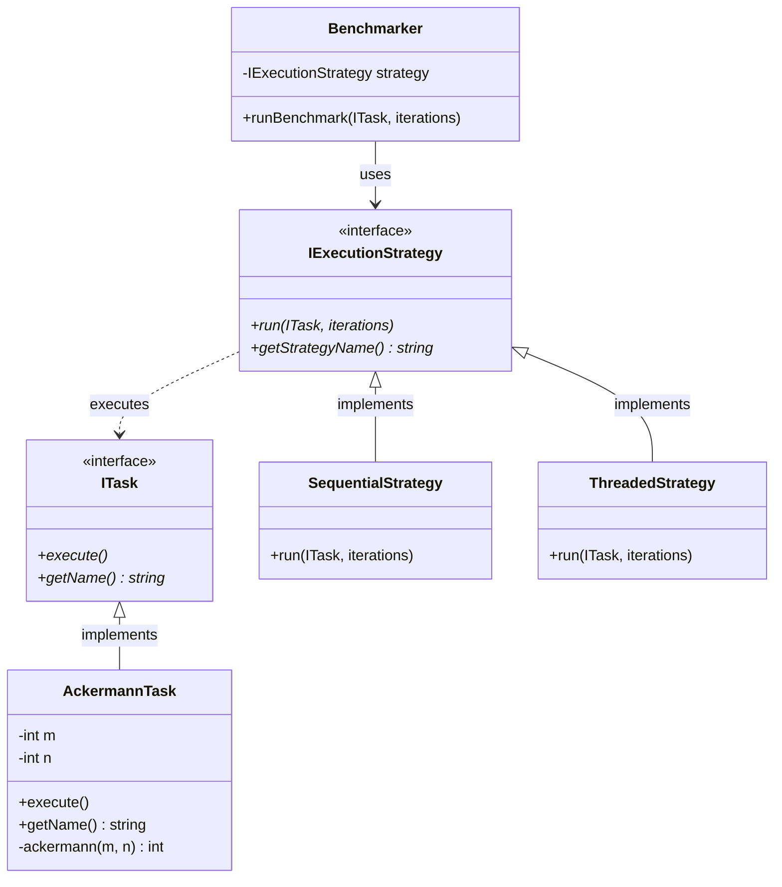
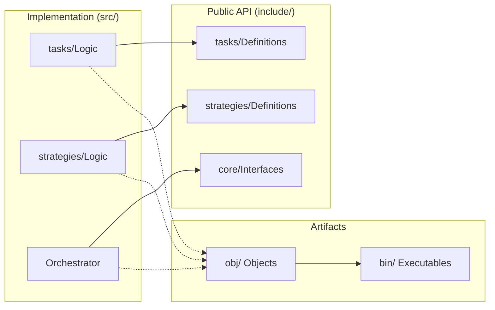

# 🏗️ System Architecture: The Pulse of Parallelism

This document outlines the high-level design and engineering principles of the **Typical vs Threaded Program Time Tester**.

## 🎯 Design Goals

- **0 Coupling**: The computational tasks (`ITask`) have no knowledge of the execution model (`IExecutionStrategy`).
- **100% Cohesion**: Each component is laser-focused. `Benchmarker` only measures time, `Task` only computes, `Strategy` only orchestrates flow.
- **Scalability**: The system is open for extension but closed for modification. Adding a new "FibonacciTask" requires zero changes to existing classes.

---

## 🗺️ Static Structure (Class Diagram)

The following diagram illustrates the relationship between the core interfaces and their concrete implementations. We use **Interface-based Programming** to ensure loose coupling.



---

## 📂 Component Architecture

The physical layout of the repository follows industry standards for C++ projects, separating public headers from private implementations.



---

## 🔄 Dynamic Execution Flow (Sequence Diagram)

This diagram shows the lifecycle of a benchmark run, specifically highlighting how the `Benchmarker` wraps the strategy's execution with high-precision timing.

```mermaid
sequenceDiagram
    participant User
    participant Main
    participant Bench as Benchmarker
    participant Strategy as IExecutionStrategy
    participant Task as ITask

    User->>Main: Execution Command (Mode 2)
    Main->>Strategy: Instantiate ThreadedStrategy
    Main->>Task: Instantiate AckermannTask
    Main->>Bench: Instantiate(Strategy)

    rect rgb(30, 30, 40)
    Note over Bench, Task: Benchmarking Lifecycle
    Bench->>Bench: Start std::chrono Timer
    Bench->>Strategy: run(Task, iterations)

    loop for each iteration
        Strategy->>Task: execute()
        Task-->>Strategy: Result
    end

    Strategy-->>Bench: Strategy Completed
    Bench->>Bench: Stop std::chrono Timer
    end

    Bench->>User: Output Performance Metrics
```



---

## 🛠 Technical Specifications

- **Concurrency Model**: C++11 Standard Threads (`std::thread`) for high-level, cross-platform parallelism.
- **Timing Engine**: `std::chrono::high_resolution_clock` (nanosecond precision).
- **Memory Management**: Modern C++ `std::shared_ptr` to ensure zero memory leaks in the orchestration layer.
- **Compiler Optimization**: `-O3` flag used during build to ensure the benchmarking represents production-level performance.

---

## 🚀 Extensibility: Adding New Benchmarks

The beauty of this architecture is its **Infinite Scalability**. To add a new computational benchmark:

1.  **Create a Task**: Implement the `ITask` interface (e.g., `FibonacciTask`).
2.  **Define Logic**: Write the heavy computation in the `execute()` method.
3.  **Inject**: Pass your new task into the `Benchmarker` with any strategy.

```cpp
// Example: No changes needed to Benchmarker or Strategies!
auto myNewTask = std::make_shared<MatrixMathTask>(1000);
benchmarker.runBenchmark(myNewTask, 10);
```

---

_Engineering transparency through sophisticated design._
