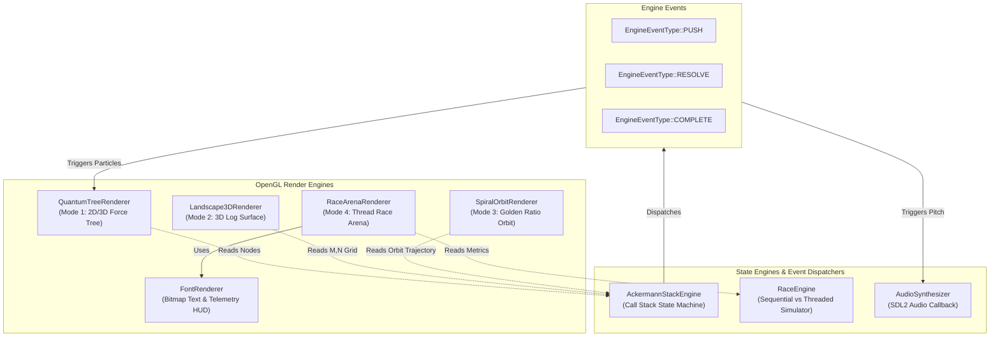
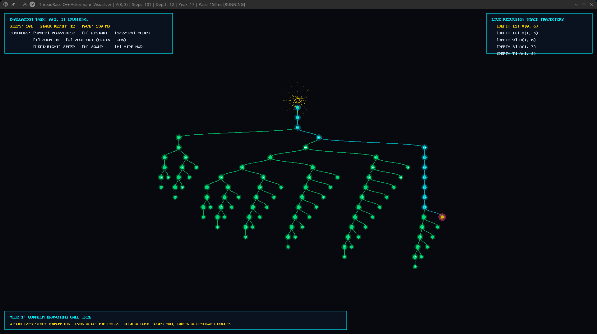
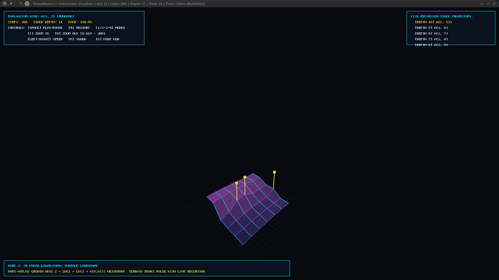
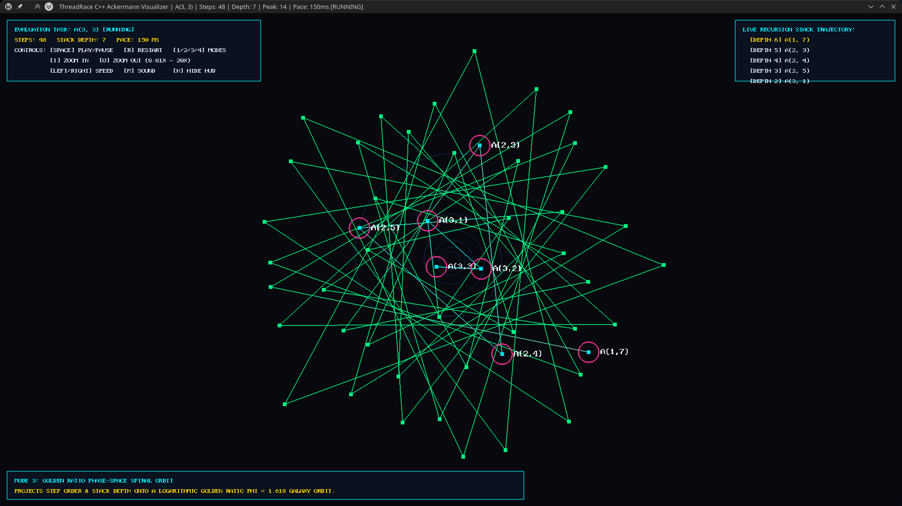
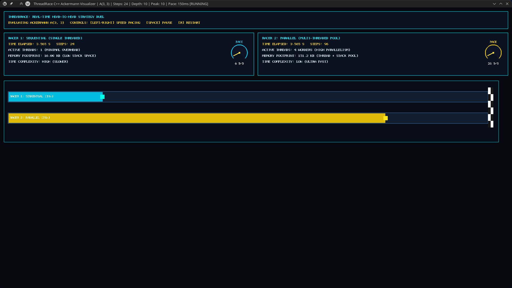
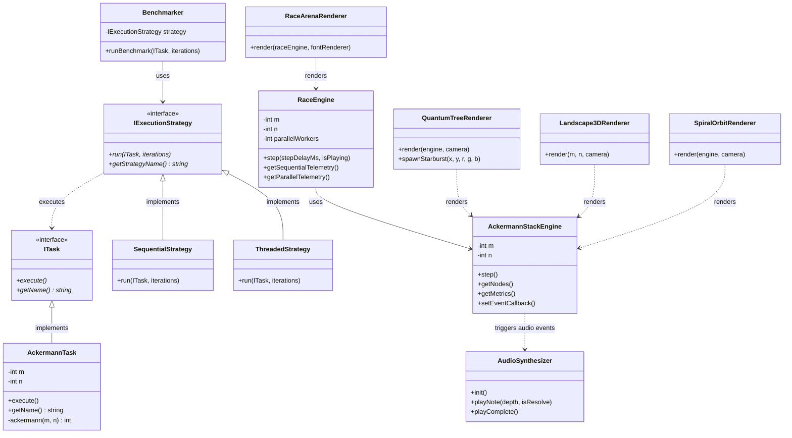
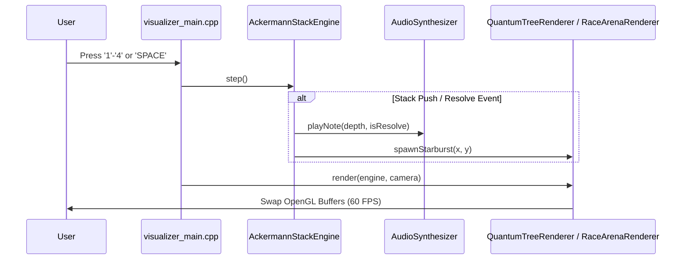

# System Architecture: The Pulse of Parallelism

This document outlines the high-level design, software architecture, and hardware acceleration principles of **ThreadRace** and its **Native C++ Ackermann Visualizer Suite**.

---

## Design Goals

- **0 Coupling**: Computational tasks (`ITask`) have no knowledge of execution strategies (`IExecutionStrategy`), and visual renderers (`QuantumTreeRenderer`, `RaceArenaRenderer`) consume engines via decoupled interfaces.
- **High Cohesion**: Each module focuses strictly on one concern:
  - `Benchmarker`: High-precision microsecond/nanosecond timing telemetry.
  - `AckermannStackEngine`: Non-blocking explicit call-stack evaluation state machine.
  - `RaceEngine`: Multi-threaded speedup telemetry simulator.
  - `AudioSynthesizer`: Real-time PCM audio waveform synthesis.
  - Renderers (`Mode 1`–`4`): Hardware-accelerated OpenGL visualization.
- **Real-Time 60 FPS Performance**: Recursive mathematical evaluation is unrolled into step-by-step state machine iterations, enabling smooth frame updates and interactive camera movement.

---

## Visualizer Subsystem Architecture

The visualizer executable (`bin/ackermann_visualizer`) bridges pure mathematics with 60 FPS OpenGL graphics and SDL2 audio synthesis.

```mermaid
%%{init: {'flowchart': {'curve': 'ortho'}}}%%
flowchart TD
    subgraph CoreEngine ["State Engines & Event Dispatchers"]
        AckEngine["AckermannStackEngine<br>(Call Stack State Machine)"]
        RaceEng["RaceEngine<br>(Sequential vs Threaded Simulator)"]
        AudioSynth["AudioSynthesizer<br>(SDL2 Audio Callback)"]
    end

    subgraph HardwareRenderers ["OpenGL Render Engines"]
        TreeRenderer["QuantumTreeRenderer<br>(Mode 1: 2D/3D Force Tree)"]
        LandRenderer["Landscape3DRenderer<br>(Mode 2: 3D Log Surface)"]
        OrbitRenderer["SpiralOrbitRenderer<br>(Mode 3: Golden Ratio Orbit)"]
        ArenaRenderer["RaceArenaRenderer<br>(Mode 4: Thread Race Arena)"]
        FontRenderer["FontRenderer<br>(Bitmap Text & Telemetry HUD)"]
    end

    subgraph EventStream ["Engine Events"]
        PUSH_EVENT["EngineEventType::PUSH"]
        RESOLVE_EVENT["EngineEventType::RESOLVE"]
        COMPLETE_EVENT["EngineEventType::COMPLETE"]
    end

    AckEngine -->|Dispatches| EventStream
    EventStream -->|Triggers Pitch| AudioSynth
    EventStream -->|Triggers Particles| TreeRenderer
    
    TreeRenderer -.->|Reads Nodes| AckEngine
    LandRenderer -.->|Reads M,N Grid| AckEngine
    OrbitRenderer -.->|Reads Orbit Trajectory| AckEngine
    ArenaRenderer -.->|Reads Metrics| RaceEng
    ArenaRenderer -->|Uses| FontRenderer
```

### Rendering Subsystems & Visual Architecture

#### Mode 1: Quantum Branching Network (2D/3D Force Tree)
Replaces native hardware stack recursion with an explicit data structure (`std::vector<StackFrame>`) to pause, resume, single-step, and render dynamic execution trees without blocking the UI main loop.

  

#### Mode 2: Hyper-Logarithmic 3D Landscape
Renders exponential mathematical growth $A(m, n)$ on a 3D terrain height map compressed using $Z(m, n) = \ln(1 + \ln(1 + A(m, n)))$.

  

#### Mode 3: Golden Spiral Phase Orbit
Maps call stack depth and frame step indices onto a logarithmic golden ratio ($\phi$) particle galaxy with dynamic orbit trails and depth rings.

  

#### Mode 4: Head-to-Head Thread Race Arena
Simulates side-by-side execution rates between a single thread and an $N$-worker parallel thread pool, reporting step velocity, RAM utilization, and speedup ratios in real-time.

  

#### Audio Sonification Engine (`AudioSynthesizer`)
Synthesizes pure sine-wave tones mapped to C-major pentatonic scale frequencies ($261.63\text{ Hz}$ to $1046.50\text{ Hz}$) based on current stack depth using SDL2 audio callbacks.

---

## Static Structure (Class Diagram)

```mermaid
classDiagram
    class ITask {
        <<interface>>
        +execute()*
        +getName()* string
    }

    class IExecutionStrategy {
        <<interface>>
        +run(ITask, iterations)*
        +getStrategyName()* string
    }

    class AckermannTask {
        -int m
        -int n
        +execute()
        +getName() string
        -ackermann(m, n) int
    }

    class SequentialStrategy {
        +run(ITask, iterations)
    }

    class ThreadedStrategy {
        +run(ITask, iterations)
    }

    class Benchmarker {
        -IExecutionStrategy strategy
        +runBenchmark(ITask, iterations)
    }

    class AckermannStackEngine {
        -int m
        -int n
        +step()
        +getNodes()
        +getMetrics()
        +setEventCallback()
    }

    class RaceEngine {
        -int m
        -int n
        -int parallelWorkers
        +step(stepDelayMs, isPlaying)
        +getSequentialTelemetry()
        +getParallelTelemetry()
    }

    class AudioSynthesizer {
        +init()
        +playNote(depth, isResolve)
        +playComplete()
    }

    class QuantumTreeRenderer {
        +render(engine, camera)
        +spawnStarburst(x, y, r, g, b)
    }

    class Landscape3DRenderer {
        +render(m, n, camera)
    }

    class SpiralOrbitRenderer {
        +render(engine, camera)
    }

    class RaceArenaRenderer {
        +render(raceEngine, fontRenderer)
    }

    ITask <|-- AckermannTask : implements
    IExecutionStrategy <|-- SequentialStrategy : implements
    IExecutionStrategy <|-- ThreadedStrategy : implements
    Benchmarker --> IExecutionStrategy : uses
    IExecutionStrategy ..> ITask : executes
    RaceEngine --> AckermannStackEngine : uses
    QuantumTreeRenderer ..> AckermannStackEngine : renders
    Landscape3DRenderer ..> AckermannStackEngine : renders
    SpiralOrbitRenderer ..> AckermannStackEngine : renders
    RaceArenaRenderer ..> RaceEngine : renders
    AckermannStackEngine ..> AudioSynthesizer : triggers audio events
```

---

## Dynamic Execution Flow

```mermaid
sequenceDiagram
    participant User
    participant VisMain as visualizer_main.cpp
    participant StackEngine as AckermannStackEngine
    participant Audio as AudioSynthesizer
    participant Renderer as QuantumTreeRenderer / RaceArenaRenderer

    User->>VisMain: Press '1'-'4' or 'SPACE'
    VisMain->>StackEngine: step()
    
    alt Stack Push / Resolve Event
        StackEngine->>Audio: playNote(depth, isResolve)
        StackEngine->>Renderer: spawnStarburst(x, y)
    end

    VisMain->>Renderer: render(engine, camera)
    Renderer->>User: Swap OpenGL Buffers (60 FPS)
```

---

## Technical Specifications

- **Graphics Subsystem**: SDL2 Windowing + OpenGL context, VSync locked at 60 FPS.
- **Audio Subsystem**: SDL2 Audio Callback generating real-time PCM audio buffers ($44.1\text{ kHz}$ sample rate, 16-bit mono).
- **Concurrency Model**: `std::thread` for parallel worker simulation and non-blocking execution strategies.
- **Timing Engine**: `std::chrono::high_resolution_clock` with nanosecond accuracy.
- **Memory Overhead**: Smart pointer management (`std::shared_ptr`) with low-footprint tree node allocation.

---

## Extensibility: Adding New Render Modes or Tasks

To extend ThreadRace with a new visualizer render mode:
1. Implement a renderer class in `include/visualizer/` and `src/visualizer/` (e.g., `CustomRenderer`).
2. Add a new `RenderMode` enum value in `visualizer_main.cpp`.
3. Call `customRenderer.render(engine, camera)` inside the main event loop.

---

_Engineering transparency through sophisticated design and visual telemetry._
